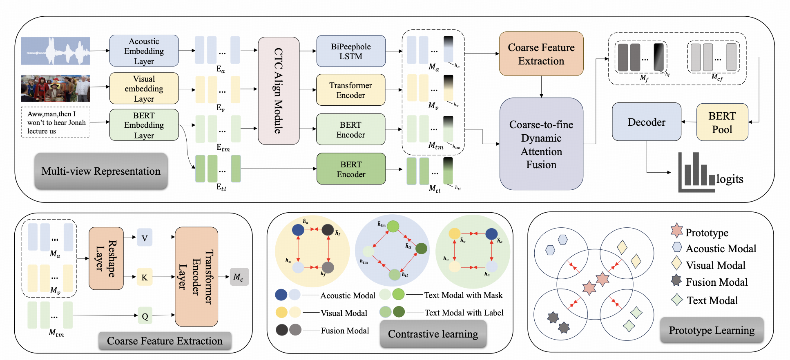

# MVCL-DAF++: Enhancing Multimodal Intent Recognition via Prototype-Aware Contrastive Alignment and Coarse-to-Fine Dynamic Attention Fusion

## Overview
**MVCL-DAF++** is an enhanced framework for **Multimodal Intent Recognition (MMIR)**.  
It addresses two key challenges in MMIR:
1. **Weak semantic grounding** — solved with **prototype-aware contrastive alignment**.  
2. **Flat fusion of modalities** — solved with **coarse-to-fine dynamic attention fusion**.  

By explicitly grounding contrastive learning in **class-level prototypes** and integrating **global summaries + token-level features**, MVCL-DAF++ improves both **robustness** and **rare-class recognition**.

<p align="center">
  
</p>

---

## Key Contributions
- 🧩 **Prototype-Aware Contrastive Alignment**:  
  Aligns instance embeddings with class prototypes → improves semantic consistency & robustness under noisy or imbalanced data.

- 🔄 **Coarse-to-Fine Dynamic Attention Fusion**:  
  Hierarchically integrates modality-level global summaries with fine-grained token features for better cross-modal interaction.

- 📊 **State-of-the-Art Results**:  
  Achieves significant gains on **MIntRec** and **MIntRec2.0**, especially for rare-class and noisy-input scenarios.

---

## Datasets
- **MIntRec [17]**: 2,224 multimodal samples (20 intent classes, text + video + audio).  
- **MIntRec2.0 [18]**: 15,040 samples (30 intent classes, long-tailed & open-intent).  

*(Citations in the paper for dataset details.)*

---

## Training Setup
- Optimizer: **AdamW**, lr=2e-5, weight decay=0.2  
- Batch size: **32**  
- Max epochs: **100**, with early stopping (10)  
- Temperature τ = 0.1  
- GPU: **NVIDIA A100-40GB**  
- Loss:
  \[
  \mathcal{L} = \mathcal{L}_{cls} + \mathcal{L}_{proto} + \mathcal{L}_{contrastive}
  \]

---

## Results

### Performance on Benchmarks
| Method          | ACC (%) | WF1 (%) | WP (%) | R (%) |
|-----------------|---------|---------|--------|-------|
| MulT            | 72.52   | 71.80   | 72.60  | 67.44 |
| MAG-BERT        | 72.16   | 71.30   | 72.03  | 67.61 |
| TCL-MAP         | 73.69   | 73.38   | 73.90  | 71.59 |
| MVCL-DAF        | 74.72   | 74.61   | 75.07  | 71.94 |
| **MVCL-DAF++**  | **76.18** | **75.66** | **76.17** | **74.39** |

On **MIntRec2.0**, MVCL-DAF++ improves **WF1 by +4.18%** and **Recall by +11.93%**, setting new SOTA:contentReference[oaicite:1]{index=1}.

---

### 🔍 Loss Function Ablation

We study the effect of different loss functions in **MVCL-DAF++** across **MIntRec** and **MIntRec2.0**.  
The comparison includes three components:  
- **Classifier Loss (CE)** – cross-entropy for intent prediction.  
- **Contrastive Loss** – instance-level InfoNCE for modality alignment.  
- **Prototype Loss** – prototype-aware InfoNCE for class-level semantic consistency.  

| Loss Functions | MIntRec ACC | MIntRec WF1 | MIntRec2.0 ACC | MIntRec2.0 WF1 |
|----------------|-------------|-------------|----------------|----------------|
| Classifier only | 74.16 | 73.88 | 59.47 | 58.49 |
| + Contrastive   | 74.61 | 74.42 | 60.11 | 58.74 |
| + Prototype     | 74.83 | 74.60 | 60.01 | 58.96 |
| **+ Contrastive + Prototype** | **76.18** | **75.66** | **60.40** | **59.23** |

**Key Findings**  
- Using **only classifier loss** leads to the weakest performance, especially on **MIntRec2.0**, showing poor generalization under noise.  
- Adding **contrastive loss** improves robustness via instance-level alignment.  
- Adding **prototype loss** further boosts performance by enforcing **class-level consistency**.  
- The **full combination** achieves the best results, confirming that **contrastive and prototype objectives complement classification** and are essential for robust multimodal intent recognition.


---
## Citation
If you use **MVCL-DAF++** in your research, please cite:

```bibtex
@inproceedings{huang2025mvcldafpp,
  title   = {MVCL-DAF++: Enhancing Multimodal Intent Recognition via Prototype-Aware Contrastive Alignment and Coarse-to-Fine Dynamic Attention Fusion},
  author  = {Haofeng Huang and Yifei Han and Long Zhang and Bin Li and Yangfan He},
  note      = {arXiv / conference ICASSP}
  year    = {2026}
}
